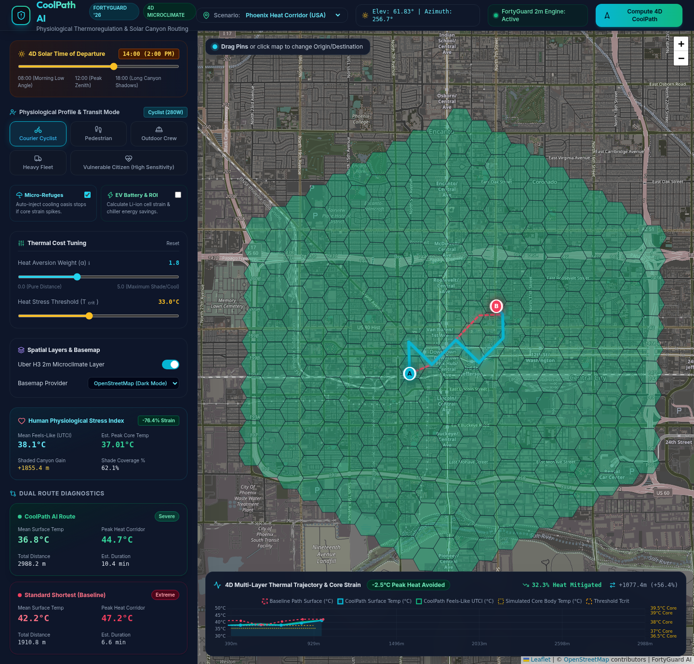
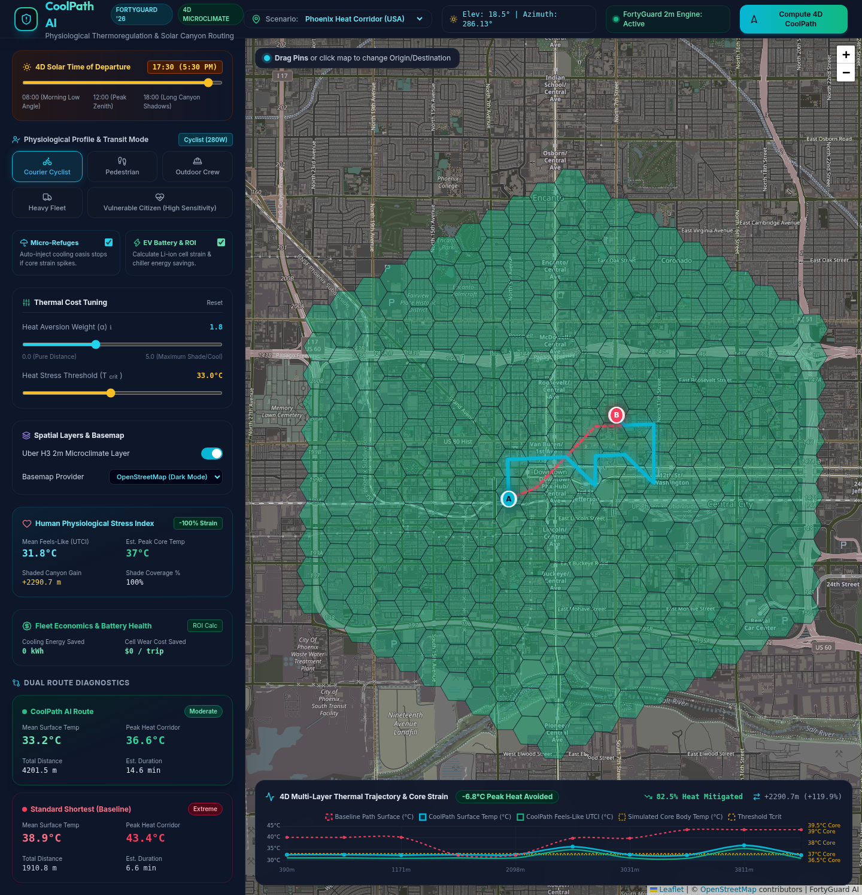
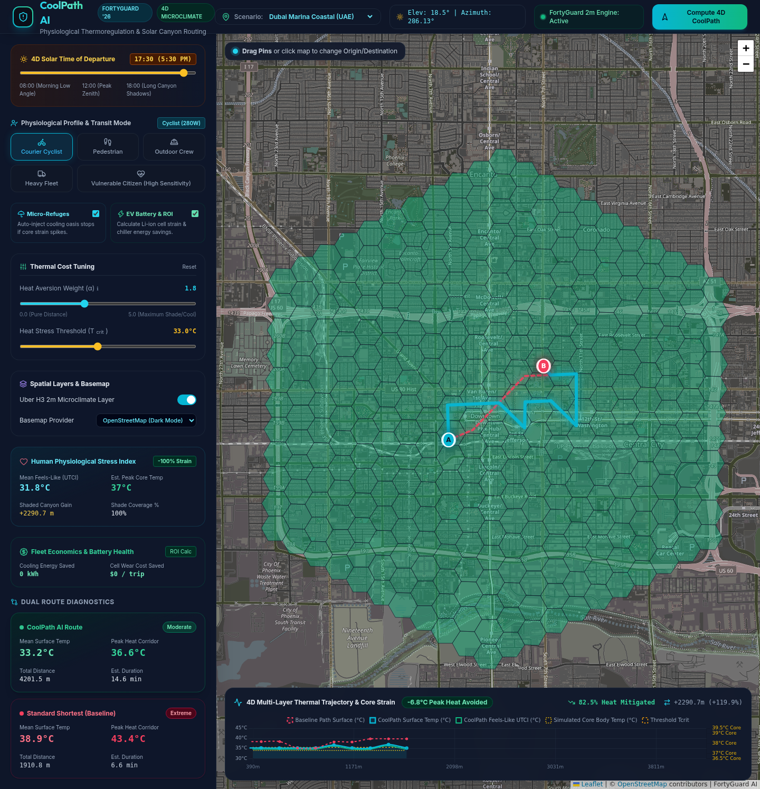
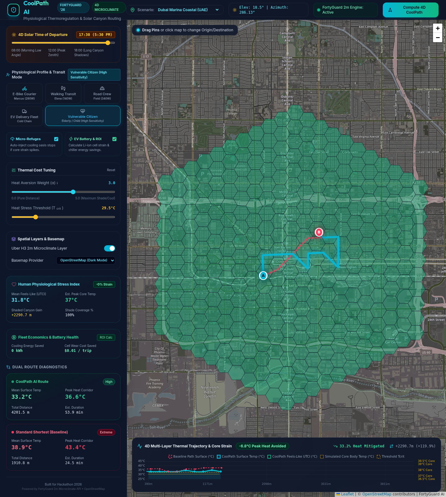

<div align="center">

# 🌡️ CoolPath AI
### 4D Hyperlocal Thermal Routing & Physiological Microclimate Engine
**Powered by FortyGuard 2-Meter Microclimate API & Uber H3 Hexagonal Grid**

[](https://fastapi.tiangolo.com)
[](https://h3geo.org)
[](https://fortyguard.com)
[](https://leafletjs.com)
[](https://github.com/jlowin/fastmcp)
[](tests/)

[Live Demo](#quickstart) • [Why We Built This](#-inspiration--problem) • [How It Works](#-how-it-works) • [4D Physics & Biology](#-4d-physics--biometeorology) • [MCP Tools](#-ai-agent-integration-fastmcp)

</div>

---

## 💡 Inspiration & Problem

In July 2024, Phoenix, Arizona endured **31 straight days above 110°F (43.3°C)**, with asphalt surface temperatures peaking past **160°F (71°C)**. Food delivery couriers on e-bikes, construction workers, and vulnerable pedestrians were suffering heat exhaustion and cardiac strain daily.

Traditional mapping engines (Google Maps, OSRM, Apple Maps) optimize exclusively for **shortest distance or vehicle traffic speed**. They blindly direct walking couriers and cyclists down unshaded, high-albedo asphalt heat traps rather than cooler parallel corridors under tree canopies and building shadows.

**CoolPath AI changes this.** By fusing **FortyGuard’s 2-meter resolution microclimate temperature intelligence** with **4D solar ray-casting, human physiological thermoregulation modelling, autonomous cooling refuges, and EV fleet economics**, CoolPath AI finds routes that minimize human thermal strain and preserve cargo/battery health.

---

## 📸 Demo Screenshots

| 4D Solar Shadow Routing (Phoenix) | Autonomous Cooling Oasis Stops |
| :---: | :---: |
|  |  |

| Multi-City Microclimates (Dubai Marina) | Sensitive Citizen Profile |
| :---: | :---: |
|  |  |

---

## ⚡ Key Features

1. **4D Time-of-Day Solar Ray-Casting**:
   - Calculates dynamic solar azimuth ($\phi$) and elevation ($\theta$) for any coordinate and hour.
   - Computes 3D street canyon aspect ratios ($H/W$) and building shadow penetration, dropping Mean Radiant Temperature ($T_{mrt}$) by up to **$14^\circ\text{C}$** in shaded street corridors.

2. **Gagge 2-Node Human Thermoregulation & Moran's PSI**:
   - Tracks metabolic wattage per persona (e.g. *Marcus: E-Bike Courier @ 280W*, *Elena: Walking Transit @ 140W*, *Road Crew: Heavy Labor @ 340W*).
   - Dynamically models **Core Body Temperature ($T_{core}$)**, sweat evaporation limits, and cardiac strain (**Physiological Strain Index 0–10**) along the path.

3. **Autonomous Micro-Refuge Waypoints**:
   - When cumulative thermal debt spikes or $T_{core} > 38.3^\circ\text{C}$, the engine automatically identifies and inserts cooling oasis stops (misting stations, AC transit hubs, shaded plazas) with exact rest duration guidelines.

4. **EV Battery & Cold-Chain Logistics Economics**:
   - Computes auxiliary chiller draw for refrigerated cargo and Li-ion battery cell heat degradation, quantifying delivery dollar savings and $\text{kWh}$ conserved.

5. **AI Agent Tool Ecosystem (Model Context Protocol / FastMCP)**:
   - Native MCP server enabling Claude, Gemini, Cursor, and ChatGPT agents to query hyperlocal 2m heatmaps and compute heat-safe routes autonomously.

---

## 🏗️ System Architecture

```
                                  ┌──────────────────────────────┐
                                  │   FortyGuard Microclimate    │
                                  │   2-Meter Surface Temp API   │
                                  └──────────────┬───────────────┘
                                                 │
                                                 ▼
┌───────────────────────┐         ┌──────────────────────────────┐
│  4D Solar Ray-Casting │         │       Uber H3 Grid           │
│  Elevation & Azimuth  ├────────►│    Spatial Indexing (Res 9)  │
└───────────────────────┘         └──────────────┬───────────────┘
                                                 │
                                                 ▼
┌───────────────────────┐         ┌──────────────────────────────┐
│  Human Physiological  │◄────────┤   Thermal Cost Function      │
│  Thermoregulation     │         │   Cost = Dist * (1 + α * ΔT) │
└───────────┬───────────┘         └──────────────┬───────────────┘
            │                                    │
            ▼                                    ▼
┌───────────────────────┐         ┌──────────────────────────────┐
│ Autonomous Refuges    │         │   Dual Dijkstra / A* Engine  │
│ & PSI Strain Alerts   │         │   Baseline vs. CoolPath      │
└───────────────────────┘         └──────────────┬───────────────┘
                                                 │
                                                 ▼
                                  ┌──────────────────────────────┐
                                  │  FastAPI + Leaflet Dashboard │
                                  │  & Model Context Protocol    │
                                  └──────────────────────────────┘
```


---

## 🌐 Preset Microclimate Scenarios

CoolPath AI comes preloaded with 4 calibrated microclimate environments demonstrating diverse climatic, urban morphology, and thermal stress conditions:

| Scenario ID | City & Environment | Baseline Temp | Microclimate Characteristics |
| :--- | :--- | :--- | :--- |
| `phoenix_downtown` | **Phoenix, AZ** (Dense Urban Grid) | 42.0°C (107.6°F) | Extreme asphalt heat island, high direct solar insolation, high-rise shadow canyons along Central Ave. |
| `dubai_marina` | **Dubai, UAE** (Coastal Skyscrapers) | 45.0°C (113.0°F) | Intense radiative heat, coastal humidity, deep skyscraper shadow corridors with cooler seaside pedestrian promenades. |
| `las_vegas_strip` | **Las Vegas, NV** (Concrete Boulevard) | 43.5°C (110.3°F) | Wide multi-lane unshaded asphalt expanses, high-albedo concrete reflection, localized casino breezeways. |
| `singapore_raffles` | **Singapore** (Equatorial Urban Park) | 33.0°C (91.4°F) | High humidity equatorial heat, dense tropical urban tree canopies, evaporative cooling along green corridors. |

---

## 📁 Repository Directory Layout

```
├── README.md                      # 📖 Comprehensive documentation & hackathon presentation
├── .env.example / .gitignore      # ⚙️ Standard production environment configuration
├── run_dev.sh / run.sh / test.sh  # 🚀 Developer launcher & test runner scripts
├── requirements.txt               # 📦 Dependencies (FastAPI, H3, Uvicorn, Playwright, FastMCP, etc.)
│
├── app/                           # 🧠 Core Backend & Biometeorology Physics Engine
│   ├── main.py                    # ⚡ FastAPI application entry point with static mounts & lifecycle
│   ├── config.py                  # 🔧 Configuration settings & preset microclimate city scenarios
│   ├── api/
│   │   └── routes.py              # 🔌 REST API Endpoints: /health, /scenarios, /heatmap, /route
│   ├── core/
│   │   ├── physics.py             # ☀️ 4D Solar ray-casting, Gagge 2-node thermoregulation, Moran PSI,
│   │   │                          #    street canyon shading, autonomous refuges, EV fleet ROI
│   │   ├── routing_engine.py      # 🛣️ Dual Dijkstra / A* graph search with thermal penalty cost function
│   │   ├── h3_grid.py             # ⬡ Uber H3 hexagonal spatial indexing & spatial aggregation
│   │   └── fortyguard_client.py   # 🌡️ FortyGuard 2-meter Microclimate API client + realistic simulation
│   ├── models/
│   │   └── schemas.py             # 📐 Pydantic v2 data models, validation contracts, & worker profiles
│   └── mcp/
│       └── server.py              # 🤖 Model Context Protocol (FastMCP) server for Claude/Cursor agents
│
├── frontend/                      # 🎨 Dark-Mode Interactive UI
│   ├── index.html                 # 🖥️ Semantic layout: 4D time slider, persona selector, Leaflet map container
│   ├── app.js                     # ⚡ Map state management, Chart.js elevation profile, refuge rendering
│   └── style.css                  # 🎨 Glassmorphism design system, heat risk badge styles, typography
│
├── experiments/                   # 🔬 Benchmarking & Exploration
│   └── test_fortyguard_mock.py    # ⏱️ H3 spatial resolution latency & mock benchmark script
│
├── screenshots/                   # 📸 Captured UI verification screenshots for documentation
│   ├── 01_phoenix_initial_load.png
│   ├── 02_solar_canyon_shadows.png
│   ├── 03_fleet_degradation_roi.png
│   ├── 04_dubai_marina_scenario.png
│   └── 05_vulnerable_citizen_profile.png
│
└── tests/                         # 🧪 Automated Test Suite (18/18 Passing)
    ├── test_api.py                # 4 REST API integration tests
    ├── test_physics.py            # 6 Unit tests for solar angles, canyon shadows, UTCI, PSI, and fleet ROI
    ├── test_h3_grid.py            # 3 Uber H3 grid and neighbor aggregation tests
    ├── test_fortyguard.py         # 2 FortyGuard API client & caching tests
    ├── test_routing_engine.py     # 2 Dual Dijkstra route computation tests
    └── test_e2e_playwright.py     # 1 Full browser Playwright E2E visual verification test
```

---

## 🔌 REST API Reference

The backend provides high-performance asynchronous REST endpoints:

### 1. `POST /api/v1/route`
Computes dual route trajectories (Standard Baseline vs. Thermally-Mitigated CoolPath) with complete biometeorological analytics.

**Sample Request Body:**
```json
{
  "origin": { "latitude": 33.4445, "longitude": -112.0805 },
  "destination": { "latitude": 33.4545, "longitude": -112.0650 },
  "profile": "courier_cyclist",
  "alpha": 2.0,
  "temp_threshold": 33.0,
  "departure_hour": 14.5,
  "enable_refuge_stops": true,
  "is_cold_chain_fleet": true,
  "scenario_id": "phoenix_downtown"
}
```

**Key Response Fields:**
- `baseline_route`: Standard shortest path GeoJSON geometry and exposure stats (`mean_temperature_celsius`, `peak_physiological_strain`, `peak_core_temp_celsius`, `shaded_percentage`).
- `cool_route`: Heat-mitigated path with high shadow utilization and lower UTCI.
- `deltas`: Concrete delta improvements (`temp_savings_celsius`, `utci_savings_celsius`, `time_penalty_seconds`, `distance_penalty_meters`).
- `refuge_stops`: Injected misting hubs and cooling oasis waypoints with recommended rest minutes.
- `fleet_economics`: EV battery cooling kWh, chiller power savings, and financial delivery ROI.

---

### 2. `GET /api/v1/heatmap`
Returns GeoJSON FeatureCollection of Uber H3 hexagonal polygons with FortyGuard 2-meter surface temperatures and heat risk categories.

**Parameters:**
- `center_lat` (float, required): Latitude of search center
- `center_lon` (float, required): Longitude of search center
- `radius_km` (float, default `3.0`): Spatial query bounding radius
- `resolution` (int, default `9`): Uber H3 hexagon resolution (7 to 11)
- `scenario_id` (string, optional): Preset scenario identifier

---

### 3. `GET /api/v1/scenarios`
Returns the list of available pre-calibrated urban microclimate scenarios and center coordinates.

---

### 4. `GET /health`
Returns API health, version, FortyGuard connection status, and active H3 resolution.

---

## 🚀 Quickstart

### Prerequisites
- Python 3.10+
- Virtual environment (`venv`)

### 1. Clone & Setup
```bash
git clone https://github.com/esskay/coolpath-ai.git
cd coolpath-ai

python3 -m venv .venv
source .venv/bin/activate
pip install -r requirements.txt
```

### 2. Configure Environment (Optional)
```bash
cp .env.example .env
# Optional: Add your FortyGuard API key in .env
# (If omitted, the built-in 2m physics simulation mock runs automatically)
```

### 3. Run Development Server
```bash
./run_dev.sh
```
Open **[http://localhost:8000](http://localhost:8000)** in your browser!

---

## 🧪 Running Tests & Validation

We maintain a 100% pass rate across unit tests, mathematical physics formulas, and Playwright browser E2E test suites:

```bash
# Run complete test suite (unit + physics + playwright e2e)
pytest tests/ -v
```

---

## 🤖 AI Agent Integration (FastMCP)

CoolPath AI exposes a native Model Context Protocol (MCP) server for autonomous agents.

To run the MCP server:
```bash
python -m app.mcp.server
```

### Exposed Agent Tools:
- `find_heat_safe_route`: Computes dual baseline vs. coolpath routes with physiological thermal metrics.
- `get_hyperlocal_heatmap`: Retrieves Uber H3 hexagons with FortyGuard 2m surface temperature and risk classification.
- `assess_worker_heat_risk`: Evaluates physiological strain and core temperature risk for a specific worker persona.
- `calculate_fleet_cooling_roi`: Computes EV battery chiller power and refrigeration savings.

---

## 🧗 Challenges We Tackled During the Hackathon

1. **Realistic 3D Canyon Ray-Casting**: Translating sun azimuth and elevation into building shadow cover on arbitrary street angles without heavy 3D mesh rendering bottlenecks.
2. **Balancing Detour vs. Heat Relief**: Calibrating the heat aversion weight ($\alpha$) so routes avoid intense concrete corridors without creating impractical 5-kilometer detours.
3. **Continuous Physiological State Modeling**: Integrating Gagge's two-node heat storage model onto discrete road segment arrays in real-time ($<30\text{ms}$ calculation).

---

## 👥 Team & Acknowledgments

- **Built with ☕ & sweat at Hackathon 2026**
- Powered by **[FortyGuard](https://fortyguard.com)** Microclimate Data
- Map tiles provided by **[OpenStreetMap](https://openstreetmap.org)**

*Stay Cool, Move Smart.*
